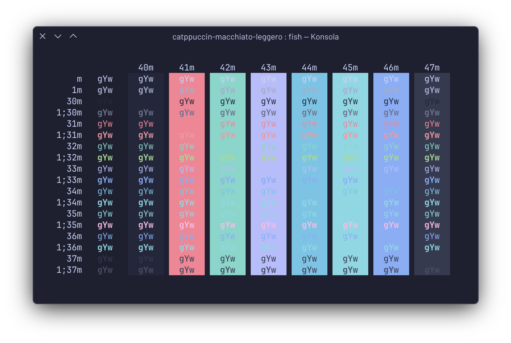
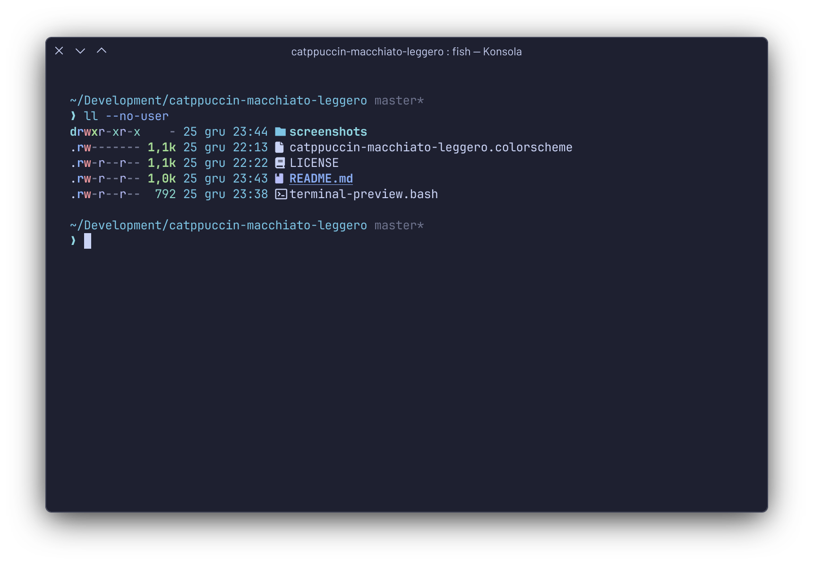
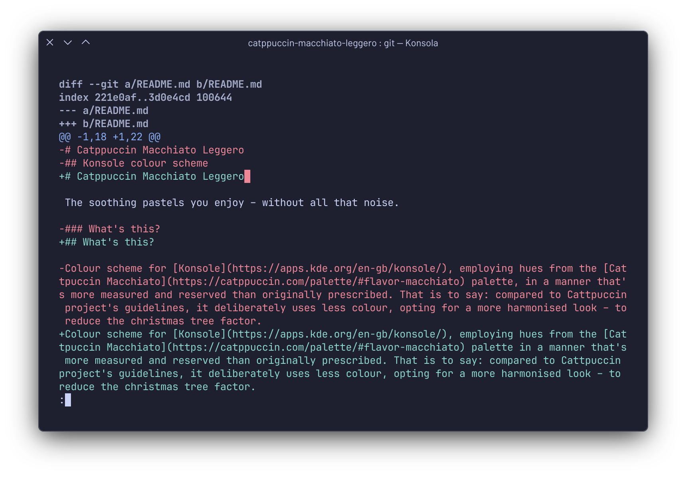

# Catppuccin Macchiato Leggero

The soothing pastels you enjoy – without all that noise.

## What's this?

Colour scheme for [Konsole](https://apps.kde.org/en-gb/konsole/), employing hues from the [Cattpuccin Macchiato](https://catppuccin.com/palette/#flavor-macchiato) palette in a manner that's more measured and reserved than originally prescribed. That is to say: compared to Cattpuccin project's guidelines, it deliberately uses less colour, opting for a more harmonised look – to reduce the christmas tree factor.

## Does it compromise on readability?

I should hope not. I spend a fair amount of time at the terminal so I tend to resolve any visibility issues on the fly.

## How do I use it?

1. Download the `.scheme` file and put it in `~/.local/share/konsole`. Then launch Konsole, go to: `Settings → Edit Current Profile → Appearance -> Color Scheme(...)`, then choose `Catppuccin Macchiato Leggero`.
2. Tweak to taste.
3. Enjoy!

## How does it look?

Something like this:

